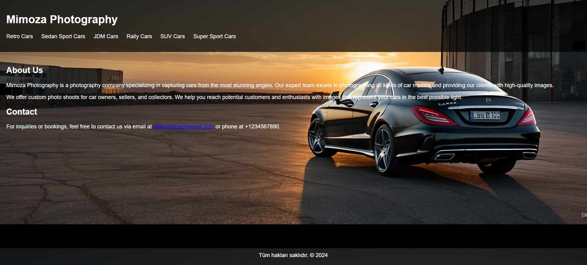
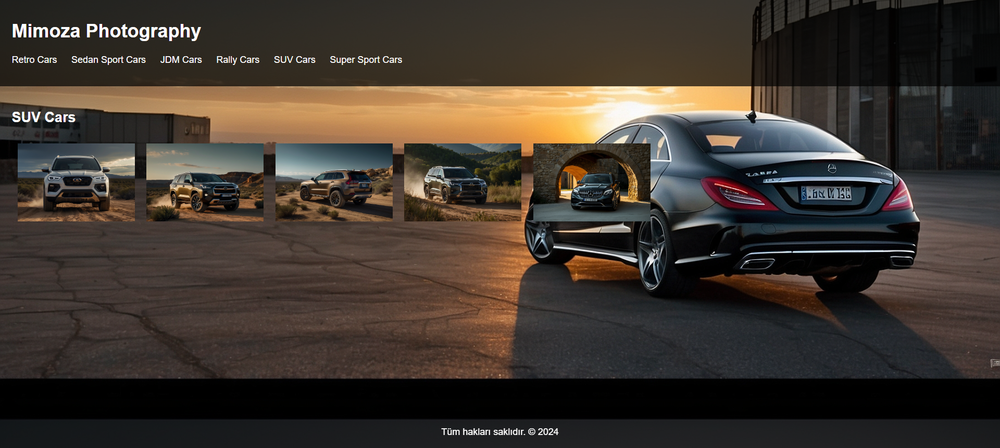
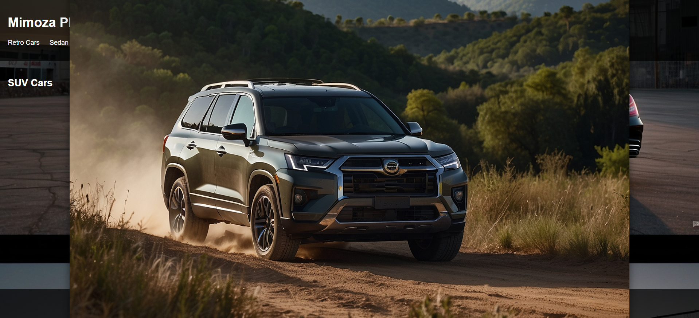

# Car Photography Portfolio

This project was generated with the assistance of artificial intelligence generated prompts. The prompt files used in the project are provided in the repository.

## Prompt Engineering

### Prompt Files

- [prompt.txt](prompt.txt)

## Features

- Dynamic loading of photos for different car categories
- Detailed view of photos by enlarging them
- Contact information section

## Usage

Clone the project files locally or download them from the GitHub page. Then, open the `index.html` file in your browser to view the website.

## Technologies Used

- HTML
- CSS
- JavaScript
- ChatGPT
- LeonardoAi

## Screenshots

## Contributing

Contributions of any kind are welcome. You can submit pull requests for adding new features, fixing bugs, or documenting the project.

